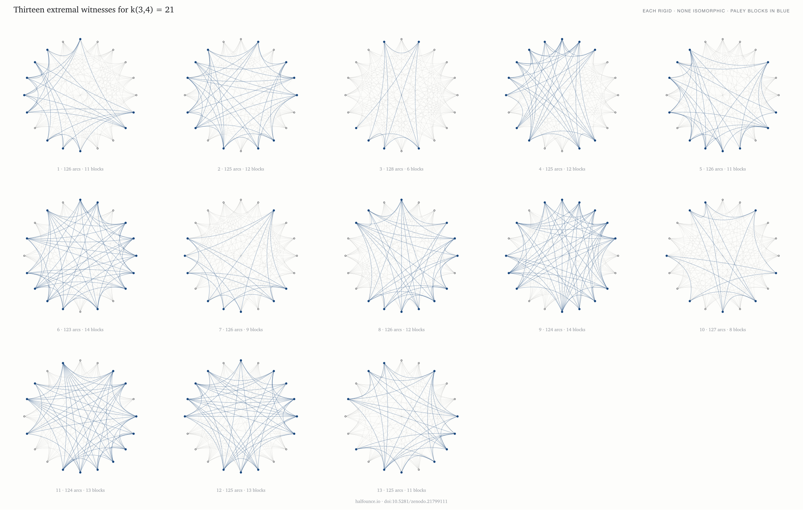

# Objects

Pictures of mathematical objects that this program proved exist.

Nothing here is decorative. Every line is the object itself — the vertices, the arcs, the
symmetries are what the theorem says they are, drawn without embellishment. If a picture looks
striking, that is a property of the object, not of the drawing.

Each piece names the result it comes from and the archived record where the object and its
verification certificate live. The mathematics is at
[github.com/05oz/certify](https://github.com/05oz/certify); the program is
[halfounce.io](https://halfounce.io).

---

## The thirteen extremal witnesses

The oriented Ramsey number k(3,4) is 21: every oriented graph on 21 vertices contains three
mutually non-adjacent vertices or a transitively ordered set of four, and there are graphs on 20
vertices containing neither. There are at least thirteen such graphs, no two alike, and each has
no symmetry at all — a *rigid* object, in the technical sense that only the identity permutation
maps it to itself.

Each panel is one of them, drawn as a chord diagram. Blue marks the vertices whose seven
non-neighbours are forced to form the Paley tournament below. That forcing is a small theorem:
a vertex's non-neighbours must form a tournament with no transitive quadruple, such tournaments
have at most seven vertices, and on seven vertices there is exactly one.

`doi:10.5281/zenodo.21890619` · `doi:10.5281/zenodo.21799111`

## QR₇ — the Paley tournament on seven vertices

Seven points; an arrow from *i* to *j* when *j − i* is a perfect square modulo 7 — that is, one
of {1, 2, 4}. It is the only tournament on seven vertices with no transitively ordered
quadruple, and it appears inside every one of the thirteen witnesses above. The pattern was not
chosen; it is forced by the constraint.

## Cay(ℤ₂₈, {3, 8, 10, 12, 17})

Twenty-eight points on a circle, each joined to the points 3, 8, 10, 12 and 17 steps ahead. The
connection set is *sum-free* — no two of its elements sum to a third — which is exactly what
makes the resulting tournament free of transitive triangles. It has independence number 5, and
so witnesses that k(6,3) ≥ 29.

The rosette and the void at the centre are not design choices. They are what those five
distances do when drawn.

`doi:10.5281/zenodo.21890619`

---

## Prints

`print/` holds 12 × 12 inch masters at 300 dpi, each with a caption plate stating the object,
the theorem it witnesses, and the DOI of its archived certificate. The `.svg` sources are
resolution-independent and can be enlarged without loss.

## Licence

Images: CC BY 4.0 — use them, credit *Half Ounce Research* and the DOI on the piece.
Source code in `src/`: Apache-2.0.

The objects themselves belong to nobody.
