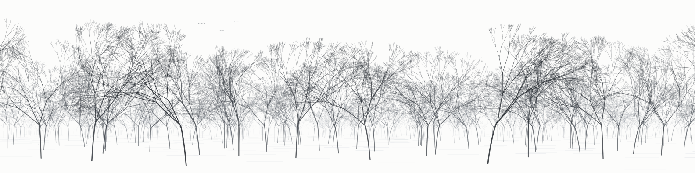
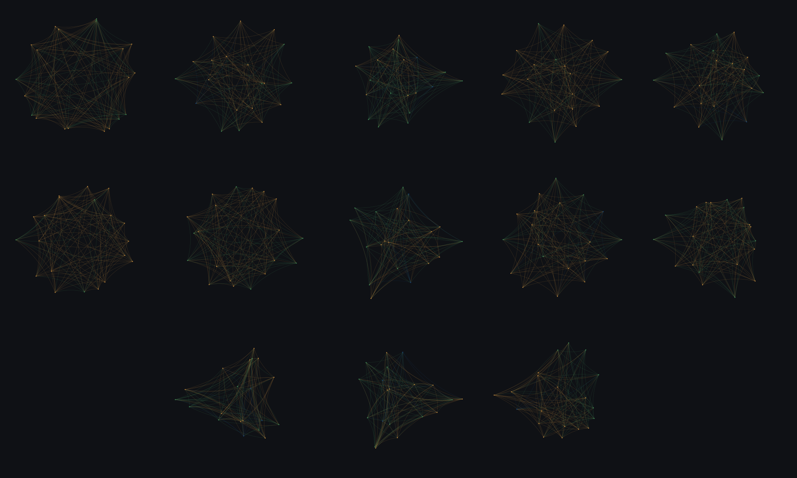
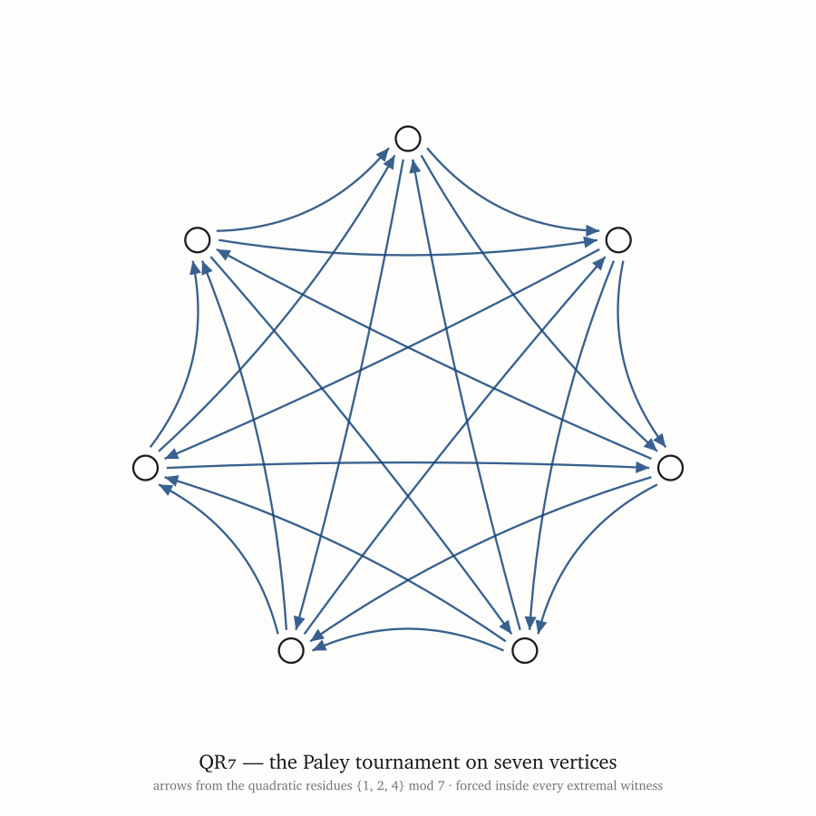
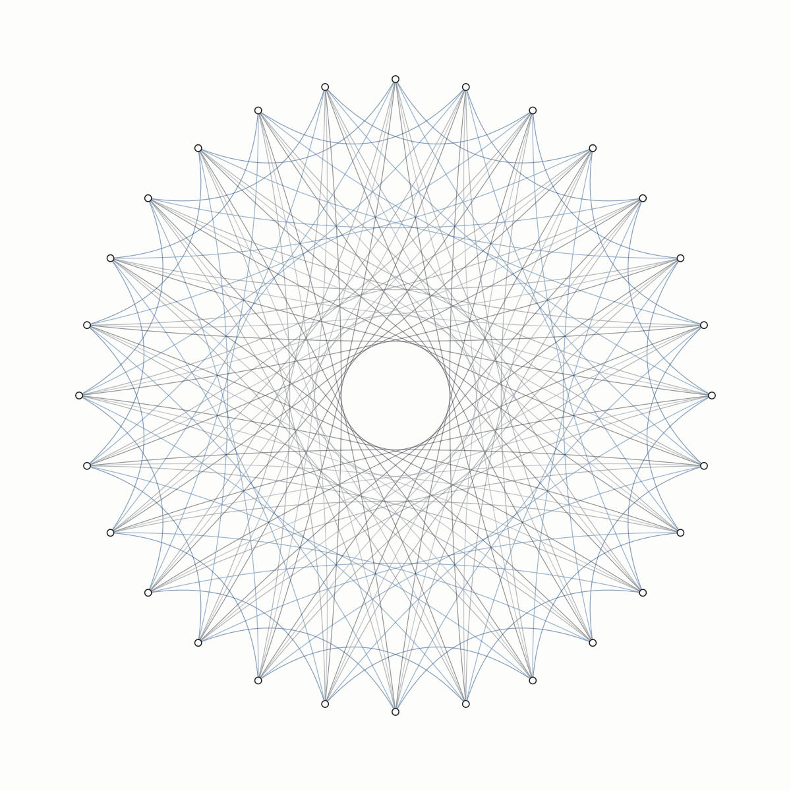

# Objects

Pictures of mathematical objects that this program proved exist.

Nothing here is decorative. Every line is the object itself — the vertices, the arcs, the
symmetries are what the theorem says they are, drawn without embellishment. If a picture looks
striking, that is a property of the object, not of the drawing.

Each piece names the result it comes from and the archived record where the object and its
verification certificate live. The mathematics is at
[github.com/05oz/certify](https://github.com/05oz/certify); the program is
[halfounce.io](https://halfounce.io).

---

## A forest, where every growth rule is a published result

Six findings decide what these trees look like, and nothing else does.

**What forks.** A branch sitting at vertex *v* of one of the thirteen rigid witnesses of
k(3,4) = 21 forks to the out-neighbours of *v*. Thirteen objects across twenty root
vertices give 260 distinct trees, and because the objects are rigid, none of them repeats.

**When it forks.** These graphs contain no four vertices in transitive order, which bounds
the longest transitive chain at three. So a lineage runs exactly three internodes and then
must fork. That constraint is the trees' rhythm — it is why they are trees and not reeds.

**Which way it turns.** QR₇ = Cay(ℤ₇,{1,2,4}) is forced as the non-neighbourhood of any
vertex with seven non-neighbours. Each arc *v* → *u* carries its Cayley difference
(*u* − *v*) mod 7, and the branch turns toward the residues {1,2,4}, away from the
non-residues {3,5,6}. Those two sets are not mirror images, so the trees lean. Reversing
every arc gives the converse digraph — still free of both forbidden patterns, and it sends
each residue to a non-residue exactly, so it draws the same tree mirrored. Half the stand
is grown that way.

**How dense the crown gets.** A_w is the exact spectrum of uncorrectable fault sets of the
distance-5 rotated surface code. The normalised log-ratios A_{w+1}/A_w, across the weights
that carry the sub-threshold probability, set how many children survive at each depth: three
near the trunk, two out at the twigs.

**What shape the crown takes.** Of the twenty certified ZEFOZ points of ¹⁶⁷Er³⁺:Y₂SiO₅,
thirteen are saddles and seven are local maxima. Saddle-type trees open and spread;
maximum-type trees close into a dome.

**How distance works.** Newell's demagnetization tensor loses about six correct decimal
digits per decade of separation and has none left near three hundred cells. That single
certified curve is the haze, the colour, and the loss of fine twigs all at once. A tree far
enough away has no significant figures left, and disappears.

Only the scatter of trees across the ground was chosen. Every tree's own form is computed.

Source: [`src/forest.py`](src/forest.py) · vector original
[`pieces/forest.svg`](pieces/forest.svg) (73,620 branches)

## Thirteen rigid objects, each placing its own points

The oriented Ramsey number k(3,4) is 21. On 20 vertices there are graphs containing neither three
mutually non-adjacent vertices nor four in transitive order — and there are at least thirteen of
them, no two alike. Every one is *rigid*: only the identity permutation maps it to itself.

Nothing here was laid out by hand. Each object's adjacency matrix, made skew-symmetric, has
purely imaginary eigenvalues whose eigenvectors give a two-dimensional frame; the vertices sit
where that frame puts them. The layout is computed from the object, not chosen for it. Colour
follows out-degree. A symmetric object would collapse into a circle under this treatment — these
cannot, because they have no symmetry to collapse into, and that is why no two of the thirteen
share a silhouette.

These pictures could not have been made before August 2026, because the objects were not known
to exist.

`doi:10.5281/zenodo.21890619`

## QR₇ — the Paley tournament on seven vertices

Seven points; an arrow from *i* to *j* when *j − i* is a perfect square modulo 7 — that is, one
of {1, 2, 4}. It is the only tournament on seven vertices with no transitively ordered
quadruple, and it appears inside every one of the thirteen witnesses above. The pattern was not
chosen; it is forced by the constraint.

## Cay(ℤ₂₈, {3, 8, 10, 12, 17})

Twenty-eight points on a circle, each joined to the points 3, 8, 10, 12 and 17 steps ahead. The
connection set is *sum-free* — no two of its elements sum to a third — which is exactly what
makes the resulting tournament free of transitive triangles. It has independence number 5, and
so witnesses that k(6,3) ≥ 29.

The rosette and the void at the centre are not design choices. They are what those five
distances do when drawn.

`doi:10.5281/zenodo.21890619`

---

## Prints

`print/` holds 12 × 12 inch masters at 300 dpi, each with a caption plate stating the object,
the theorem it witnesses, and the DOI of its archived certificate. The `.svg` sources are
resolution-independent and can be enlarged without loss.

## Licence

Images: CC BY 4.0 — use them, credit *Half Ounce Research* and the DOI on the piece.
Source code in `src/`: Apache-2.0.

The objects themselves belong to nobody.
