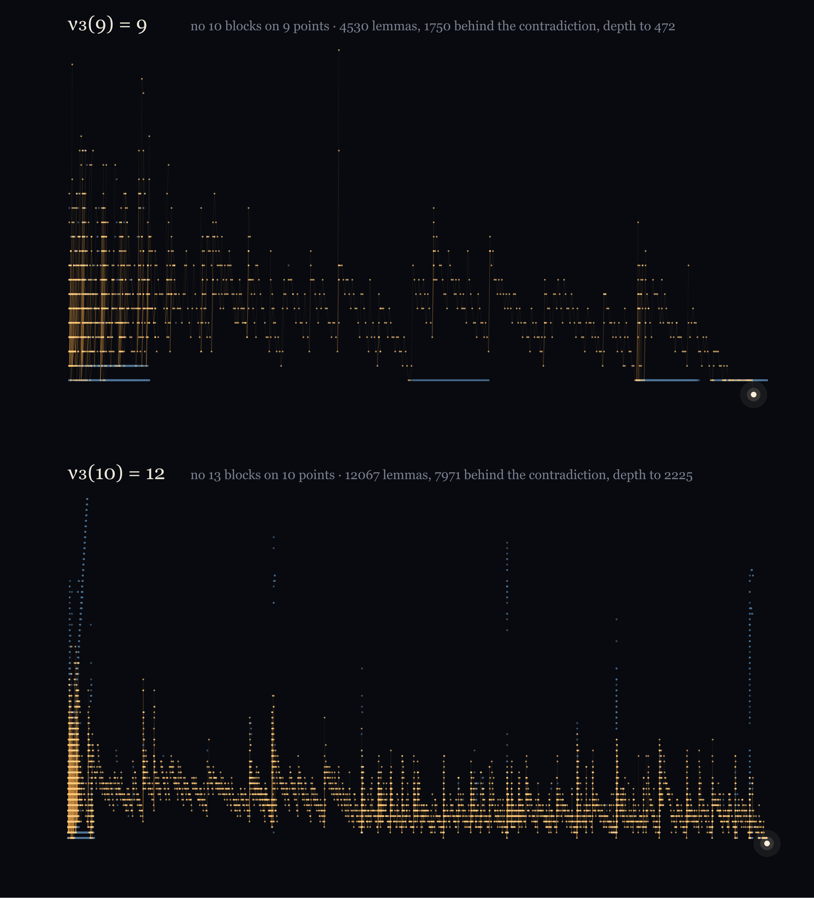
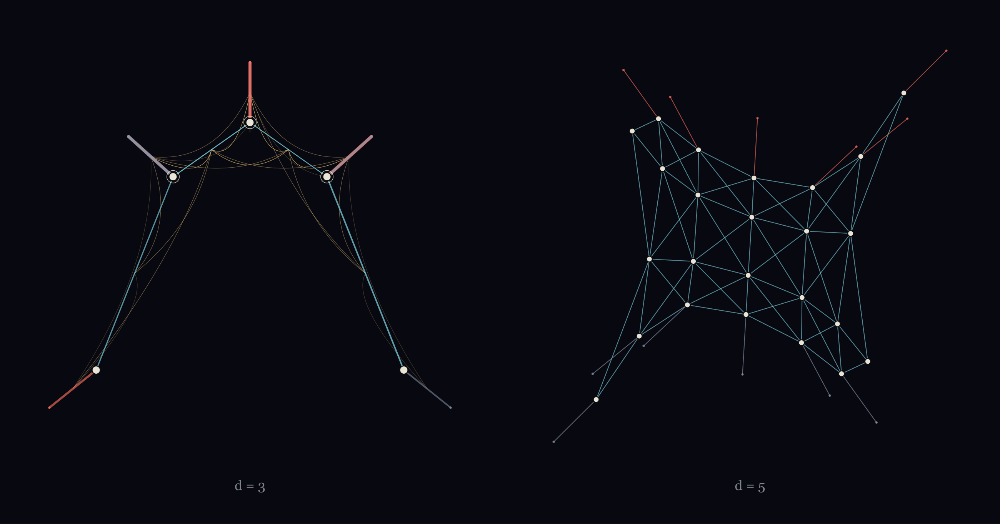
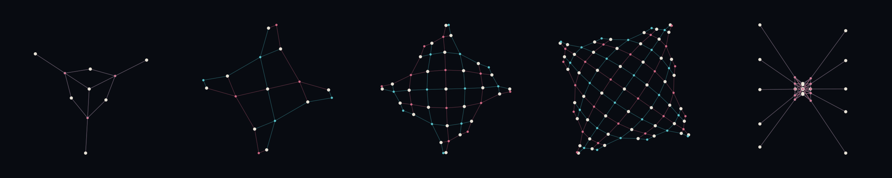
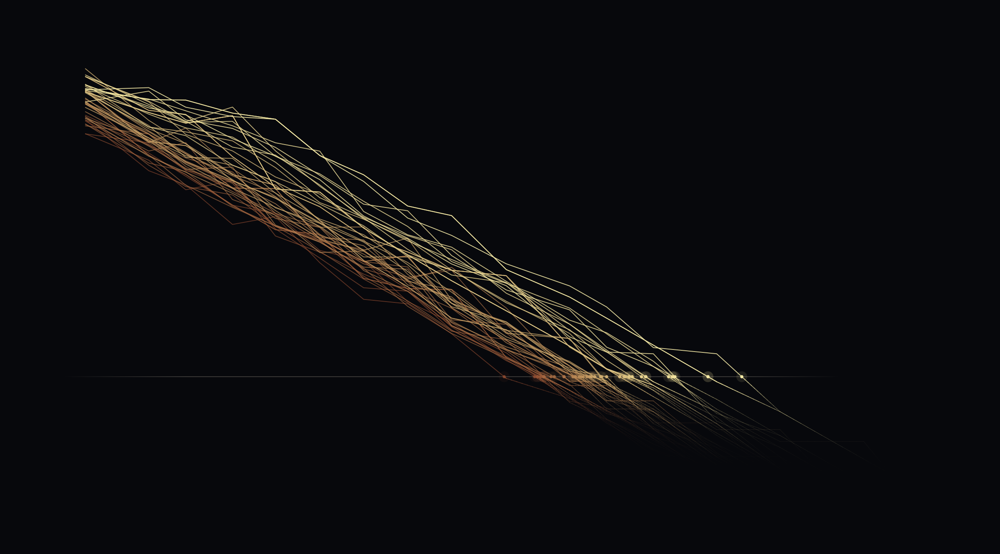
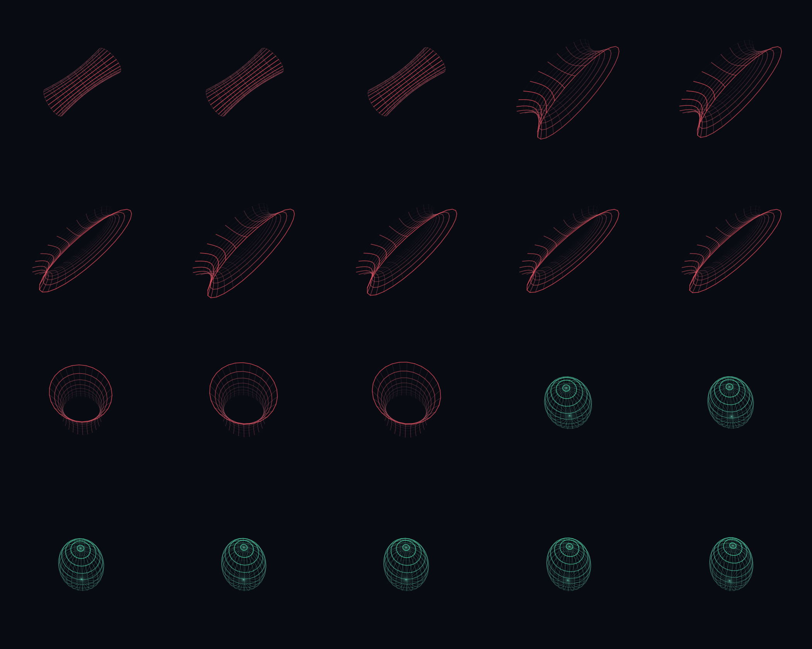
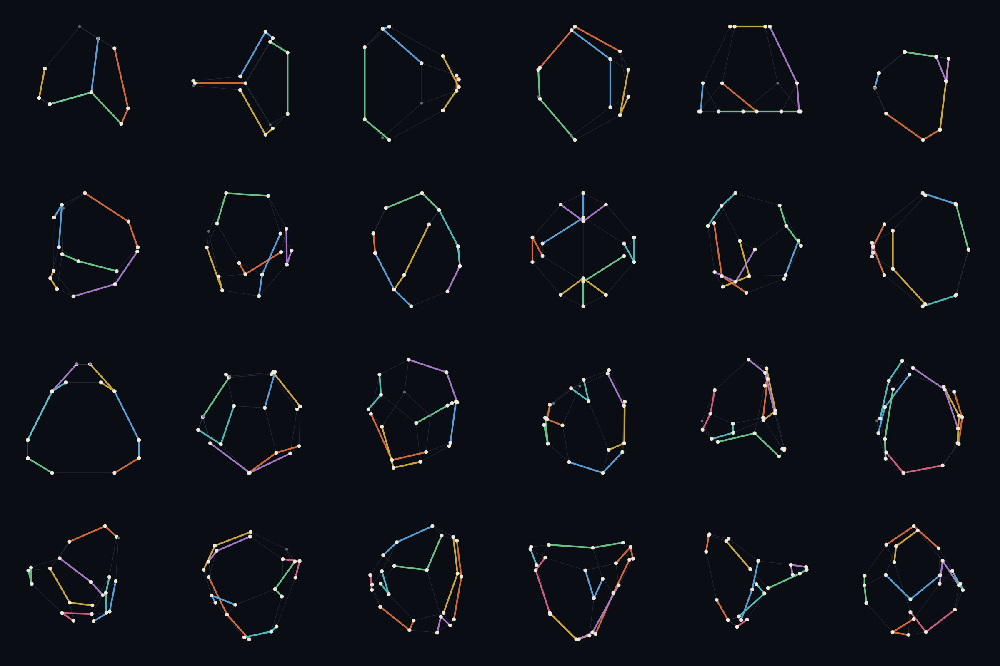
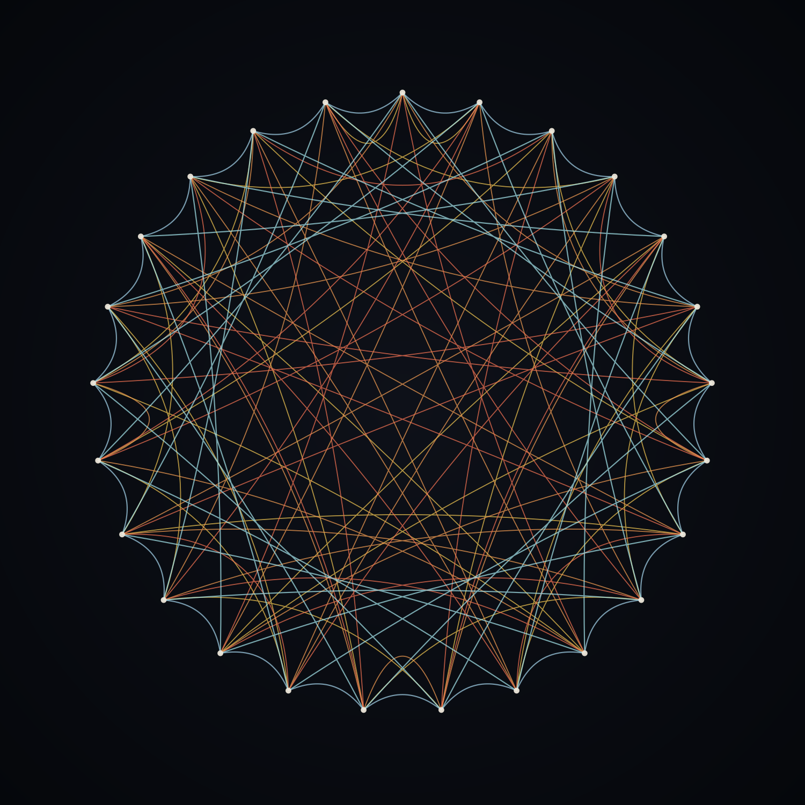
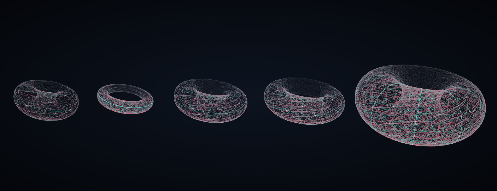
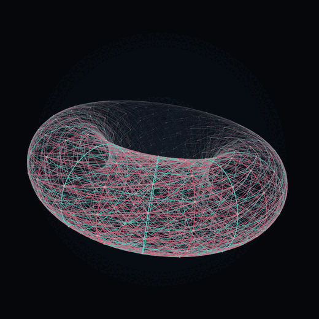
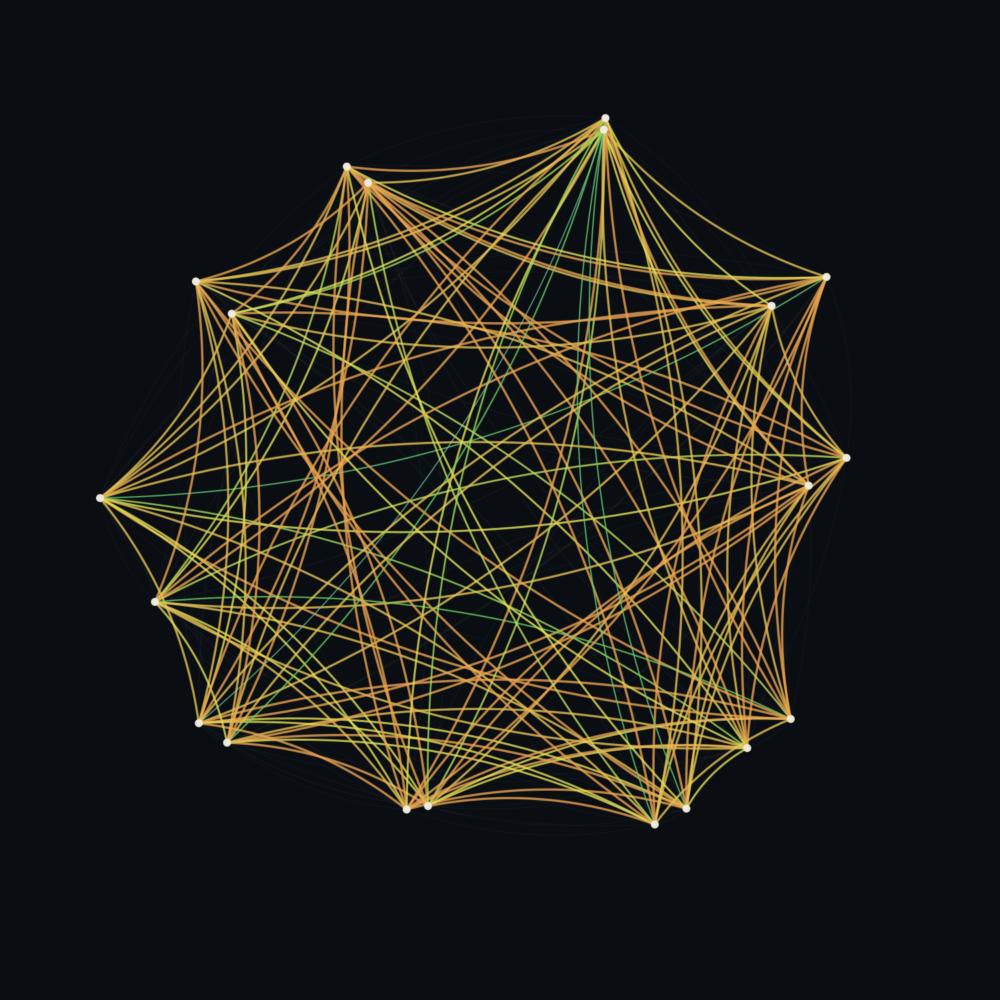

# Objects

Pictures of mathematical objects that this program proved exist.

Nothing here is decorative and nothing here is designed. Every piece is an object this program
proved exists, drawn on the structure it already has — the layout computed from the object, not
chosen for it. If a picture looks striking, that is a property of the object, not of the drawing.

The mathematics is at [github.com/05oz/certify](https://github.com/05oz/certify); the program is
[halfounce.io](https://halfounce.io).

---

## The shape of a machine proof

Source: [`src/proof.py`](src/proof.py) · [`pieces/proof.svg`](pieces/proof.svg)

`doi:10.5281/zenodo.21816010`

---

## What a decoder sees, and where the code breaks

Source: [`src/failure.py`](src/failure.py) · [`pieces/failure.svg`](pieces/failure.svg)

`doi:10.5281/zenodo.21895825`

---

## Five codes, asked what shape they are

Source: [`src/tanner.py`](src/tanner.py) · [`pieces/tanner.svg`](pieces/tanner.svg)

`doi:10.5281/zenodo.21799780`

---

## Where the arithmetic stops being true

Source: [`src/digits.py`](src/digits.py) · [`pieces/digits.svg`](pieces/digits.svg)

`doi:10.5281/zenodo.21922469`

---

## Twenty clock transitions, as the curvature that certifies them

Source: [`src/curvature.py`](src/curvature.py) · [`pieces/curvature.svg`](pieces/curvature.svg)

`doi:10.5281/zenodo.21898996`

---

## Certified packings

Source: [`src/packings.py`](src/packings.py) · [`pieces/packings.svg`](pieces/packings.svg)

`doi:10.5281/zenodo.21897011`

---

## Five permutations that cannot all be regular

Source: [`src/florentine.py`](src/florentine.py) · [`pieces/florentine.svg`](pieces/florentine.svg)

`doi:10.5281/zenodo.21831896`

---

## The bivariate bicycle family

Source: [`src/family.py`](src/family.py) · [`pieces/family.svg`](pieces/family.svg)

`doi:10.5281/zenodo.21831995`

---

## The gross code on its torus

One lattice step of rotation; the code is quasi-cyclic, so the loop closes on itself.
Still frame: [`pieces/gross.png`](pieces/gross.png)

Source: [`src/gross.py`](src/gross.py) · [`pieces/gross.svg`](pieces/gross.svg)

`doi:10.5281/zenodo.21831995`

---

## Thirteen, in one frame

Source: [`src/thirteen_anim.py`](src/thirteen_anim.py) · [`pieces/thirteen.svg`](pieces/thirteen.svg) (animated)

`doi:10.5281/zenodo.21898266`

---

## Thirteen rigid objects

Source: [`pieces/spectral_grid.svg`](pieces/spectral_grid.svg) · panels `pieces/spectral_01.svg` … `spectral_13.svg`

`doi:10.5281/zenodo.21898266`

---

## QR₇

Source: [`pieces/paley_qr7.svg`](pieces/paley_qr7.svg)

`doi:10.5281/zenodo.21890619`

---

## Cay(ℤ₂₈, {3, 8, 10, 12, 17})

Source: [`pieces/circulant_k63.svg`](pieces/circulant_k63.svg)

`doi:10.5281/zenodo.21890619`

---

## Prints

`print/` holds 12 × 12 inch masters at 300 dpi.

## Licence

Images: CC BY 4.0, full text in [`LICENSE-CC-BY-4.0.txt`](LICENSE-CC-BY-4.0.txt) — use them,
credit *Half Ounce Research* and the DOI recorded with the piece.
Source code in `src/`: Apache-2.0, full text in
[`LICENSE-Apache-2.0.txt`](LICENSE-Apache-2.0.txt).

The objects themselves belong to nobody.
